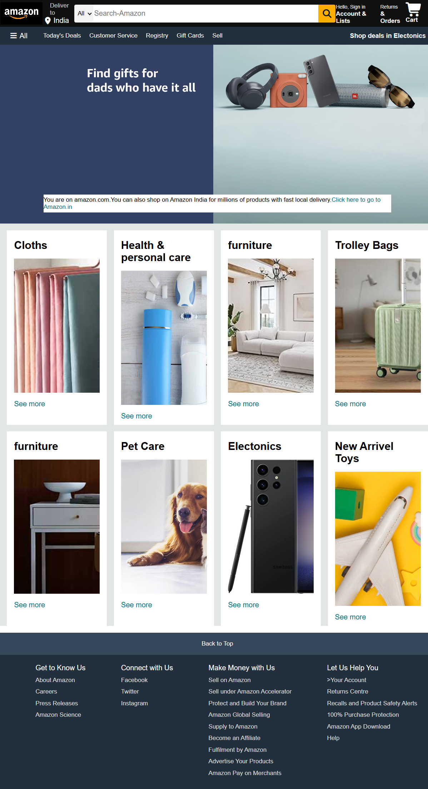

# 🛒 Amazon Clone

🚀 A fully responsive Amazon-inspired e-commerce UI built using **HTML & CSS**.  
This project replicates the layout and core design of Amazon with a clean and modern interface.

---

## 🌐 Live Demo
👉 https://sarojkumariitm.github.io/Amazon-Clone/

---

## 📸 Screenshots

---

## ✨ Features
- Fully responsive design 📱💻
- Navigation bar with search 🔍
- Product grid layout 🛍️
- Hero section banner 🎯
- Footer with multiple sections 📑

---

## 🛠️ Tech Stack
- HTML5
- CSS3 (Flexbox + Grid)

---

## 📂 Project Structure
-amazon-clone/
│── index.html
│── style.css
│── images/
│    └── project.png

---

## 🎯 Purpose
This project was created to practice frontend development skills using HTML and CSS.
It focuses on building real-world UI layouts, improving design understanding, and learning responsive web design techniques.

---
## 👨‍💻 Author
Saroj Kumar Yadav  
GitHub: https://github.com/SarojKumarIITM
